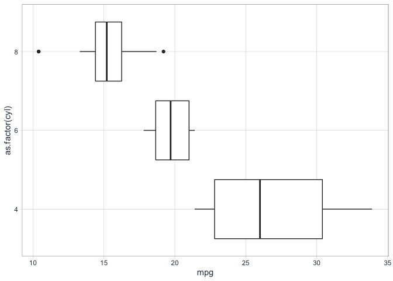

boxplots
================

### Boxplot pro-tips

``` r
library(tidyverse)
```

    ## ── Attaching packages ────────────────────────────────────────────────── tidyverse 1.3.0 ──

    ## ✓ ggplot2 3.3.0     ✓ purrr   0.3.4
    ## ✓ tibble  3.0.1     ✓ dplyr   0.8.5
    ## ✓ tidyr   1.0.2     ✓ stringr 1.4.0
    ## ✓ readr   1.3.1     ✓ forcats 0.5.0

    ## ── Conflicts ───────────────────────────────────────────────────── tidyverse_conflicts() ──
    ## x dplyr::filter() masks stats::filter()
    ## x dplyr::lag()    masks stats::lag()

``` r
library(tidyquant)
```

    ## Loading required package: lubridate

    ## 
    ## Attaching package: 'lubridate'

    ## The following objects are masked from 'package:dplyr':
    ## 
    ##     intersect, setdiff, union

    ## The following objects are masked from 'package:base':
    ## 
    ##     date, intersect, setdiff, union

    ## Loading required package: PerformanceAnalytics

    ## Loading required package: xts

    ## Loading required package: zoo

    ## 
    ## Attaching package: 'zoo'

    ## The following objects are masked from 'package:base':
    ## 
    ##     as.Date, as.Date.numeric

    ## 
    ## Attaching package: 'xts'

    ## The following objects are masked from 'package:dplyr':
    ## 
    ##     first, last

    ## 
    ## Attaching package: 'PerformanceAnalytics'

    ## The following object is masked from 'package:graphics':
    ## 
    ##     legend

    ## Loading required package: quantmod

    ## Loading required package: TTR

    ## Registered S3 method overwritten by 'quantmod':
    ##   method            from
    ##   as.zoo.data.frame zoo

    ## Version 0.4-0 included new data defaults. See ?getSymbols.

    ## ══ Need to Learn tidyquant? ═══════════════════════════════════════════════════════════════
    ## Business Science offers a 1-hour course - Learning Lab #9: Performance Analysis & Portfolio Optimization with tidyquant!
    ## </> Learn more at: https://university.business-science.io/p/learning-labs-pro </>

``` r
theme_set(theme_tq())

mtcars %>% tibble() %>% 
    ggplot(aes(x = as.factor(cyl), y = mpg)) +
    geom_boxplot() + coord_flip()
```

<!-- -->
