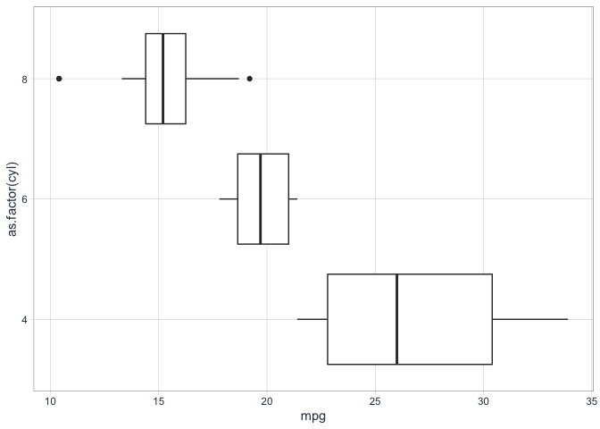

boxplots
================

### Boxplot pro-tips

  - Helps answer the question: "how does X (ind. var) affect Y (dep.
    var)?

<!-- end list -->

``` r
mtcars %>% tibble() %>% 
    ggplot(aes(x = as.factor(cyl), y = mpg)) +
    geom_boxplot() + coord_flip()
```

<!-- -->
